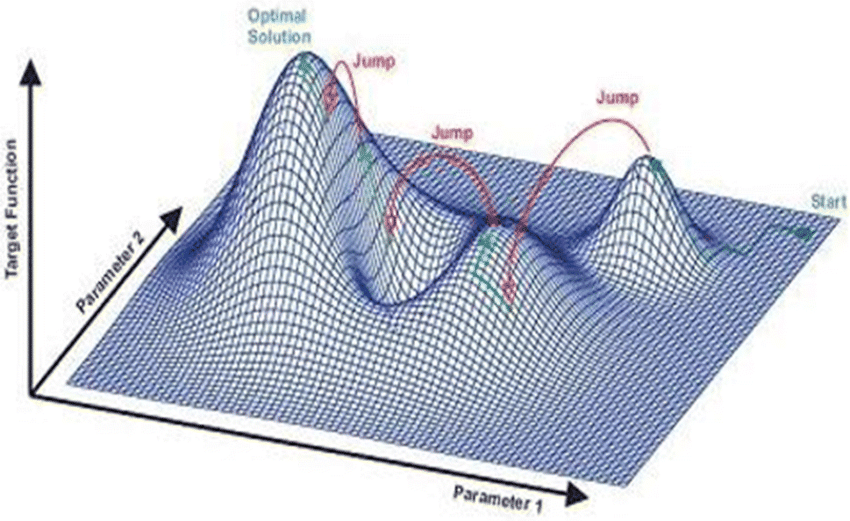

# Winmeets
Its a bunch of random small programs using data about swimming that I am using to, as the name suggests, win meets. Maybe at some point I will turn this into a package, but first i would need to make all of the code understandable by other humans

# `relay.py` 
Uses a genetic algorithm to create the optimal set of relays for high school swimming.
---
## Why this problem is difficult
Our problem can be broken down into this simple of terms: 
- Create three relays, 4x50 Free, 4x100 Free, and 4x50 Medley
    - Each swimmer can only swim one leg in a relay
    - Each swimmer can only be in a maximum of 2 relays

Creating a single optimal relay is simple computationally. 
- to find the fastest free relay, it is literally just your 4 fastest swimmers. 

- For medleys relays, its still pretty simple, just generate every single possible combination of your 4 fastest swimmers of each stroke in relays, and then see which one is the fastest of those permutations is your quickest relay.
    - you need to generate all of these combinations, because you do not know, for example, where to put someone who is both your fastest freestyler and your fastest backstroker.
    - The worst case scenario of this algorithm(in which of all of your swimmers, none of them are in the top 4 )

**The real problem is finding the fastest combination of multiple relays when your swimmers are limited on how many they can swim, such as in high school swimming.**

When we get to this point, this becomes a solution space problem, where we have a way too many solutions (around 4 quadrillion) and dont know how to find the best one. The solution space might look something like this

Where there are local maxima that look like they might be the best solution, but arent. Also, instead of only having two dimensional parameters, we have 12, because there are 12 people on this set of relays.
## How we solve this problem
Solution space problems like these are often describe through the analogy of hikers trying to climb the tallest mountain.
- We cannot check every inch of the mountain range to see if it is the highest point, because that would take to long (Brute Force algorithm)
- if we simply always climb to upward until we cannot go up anymore, we can end up stuck on a peak that isnt the tallest (Gradient Ascent algorithm)
- we cannot guarantee to find the highest point in any given time by simply randomly jumping around (Random Search)

The optimal way to solve our problem is through a **Genetic Algorithm**, which in our hikers analogy would mean we have 1000 hikers who all start in random locations, all sharing information on who is the highest, and the lower hikers moving up to the higher hikers, occasionally exploring new areas, while every individual graudally finds their way to the top. This approach balances exploration (searching new areas) and exploitation (refining known good solutions) to efficiently navigate the solution space.

### The Algorithm

#### 1. Create the population
- We initialize 1000 individuals all using completely random relay assignments
    - We use data from the `Team` class structure that I created orignally, which can be scraped from SwimCloud and saved to a JSON
    - Every indivudal relay slot is referred to as a *chromosome*, because later we will cross them over with other individuals
#### 2. Check Fitness
- We use the `fitness()` function on every individual, which just checks the total time of all three relays combined by just summing up the times. 
- Lower is better in this case
- If the individual breaks the assignment rules, like having a swimmer twice in one relay, or a swimmer in all 3 relays, they will have an infinite fitness value
#### 3. Selection
- We pick the 500 individuals with the worst(highest) fitness values, and delete them, leaving the 500 best individuals
#### 4. Crossover and Mutation
- The 500 remaining individuals will be randomly selected to crossover chromosomes with other individuals to create new indivudals, getting back to a population of 1000
- Some of the children(the new individuals) will also have a random chance to mutate, or get a completely new chromosome replacing one inherited from a parent.
#### 5. Repeat this 100 Times(100 generations)
#### 6. The best individual is the fastest relay

---

# master.py
This is where all the important class structures and such are. 
I definitely need to clean up the code if were to release this as a package

### `Team` Class
A class representing a swim team. It can be initialized with a URL to fetch team data or with data from a JSON file.
Attributes:

    name: Name of the team.
    url: URL of the team's home page.
    team_m: List of male swimmers.
    team_f: List of female swimmers.

Methods:

    __init__(self, url='b', u='l'): Initializes the team object.
    __str__(self): Returns a string representation of the team.
    save(self): Saves the team data to a JSON file.
    add(self, player, gender): Adds a swimmer to the team.
    remove(self, player): Removes a swimmer from the team by name.
    refresh(self, person=-1): Refreshes the team data.
    save_to_workbook(self, template_file='./template.xlsx'): Saves the team data to an Excel workbook. to be viewed in a nice manner

### `Swimmer` class

A class representing a swimmer. It can be initialized with a URL to fetch swimmer data or with data from a JSON file.

Attributes:

    `name`: Name of the swimmer.
    `url`: URL of the swimmer's page.
    `times`: Dictionary of event times.

Methods:

    `__init__(self, url, u='u')`: Initializes the swimmer object.
    `__str__(self)`: Returns a string representation of the swimmer.
    `save(self)`: Saves the swimmer data in a format compatible with the Team class.
---
