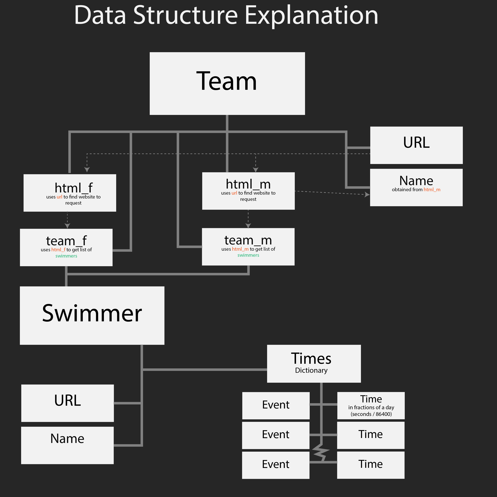

# Data Structures

## Team(url)
- Has the team `Name`, self explanatory. Special Characters may be converted into their unicode reference( `'` becomes `#x27;` )
- The `url` is the [Swimcloud](https://swimcloud.com) home page of the team ([Example](https://www.swimcloud.com/team/44/))
- Comprised of `Swimmer` objects
- These Swimmer objects are sorted into `team_m` and `team_f`, the male and female team of the team

# Swimmer(url)
- **\*\*VERY IMPORTANT NOTE:** If a swimmer does not have their Swimcloud profiles merged, not all of their times will show up. This is a large problem for high school teams, where you have a high school profile with slow high school times, and a club profile with all of your fast times. [To fix this problem, read this guide](https://support.swimcloud.com/hc/en-us/articles/115004776054-I-have-duplicate-profiles)

- Contains `Name`, which is their name on Swimcloud. Once again, special characters may be converted into unicode references.
- Contains `url`, which is the url of their swimcloud page. once again, look at the note above
- Contains `times` dictionary
    - the `times` diction has two values in each set, `event`, and `time`
    - `event`, String in the format of `<length> <course> <stroke(shorthand)>`. Ex `50 Y Free`, `100 L Breast`
    - `time`, Float point corresponding to the fraction of a day. 1.0 = 1 day, or 86400 seconds\
    - EDIT: `time` is a now a list, `time[0]` is a float, `time[1]` is a string of the time(for humans)
    - Conversion formula: `(<Minutes>*60+<Seconds>) / 86400`

